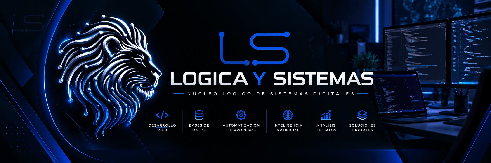

<div align="center">



</div>

<br>

<div align="center">

# 👋 Hola, soy Luis Sánchez

### Analista de Sistemas | Desarrollador de Software

Desarrollo soluciones digitales combinando **Frontend, Backend, Bases de Datos, Automatización e Inteligencia Artificial.**

</div>

---

## 🚀 Sobre mí

Soy **Analista de Sistemas y Desarrollador de Software**, enfocado en la creación de soluciones digitales para resolver necesidades reales de empresas y negocios.

Me interesa desarrollar aplicaciones que sean funcionales, escalables y fáciles de utilizar, combinando desarrollo web, gestión de datos, automatización y nuevas tecnologías.

Actualmente trabajo principalmente con el ecosistema **JavaScript / TypeScript**, desarrollo **Frontend y Backend**, bases de datos relacionales y herramientas para análisis y automatización.

### 💡 Lo que hago

- 🌐 Desarrollo de aplicaciones web.
- 🎨 Desarrollo Frontend.
- ⚙️ Desarrollo Backend.
- 🔌 Creación e integración de APIs.
- 🗄️ Diseño y gestión de bases de datos.
- 📊 Análisis y visualización de datos.
- 🔄 Automatización de procesos.
- 🤖 Integración de Inteligencia Artificial.
- 🔳 Desarrollo de soluciones con códigos QR.
- 📡 Soluciones basadas en tecnología NFC.
- 🏢 Integración con sistemas empresariales.
- 🛠️ Soporte y administración de sistemas informáticos.

---

# 💻 Stack tecnológico

## 🎨 Frontend

<p align="left">


</p>

- HTML5
- CSS3
- JavaScript
- TypeScript
- React
- Next.js
- JSX / TSX
- Tailwind CSS
- CSS Modules
- Responsive Design
- UI / UX

---

## ⚙️ Backend

<p align="left">


</p>

- Node.js
- TypeScript
- APIs REST
- Desarrollo de servicios Backend
- Lógica de negocio
- Autenticación
- Gestión de sesiones
- Integración de servicios
- Procesamiento de información
- Conexión con bases de datos
- Desarrollo de aplicaciones Full Stack

---

## 🗄️ Bases de datos

<p align="left">


</p>

- PostgreSQL
- SQL
- Diseño de bases de datos
- Consultas SQL
- Relaciones entre tablas
- Modelado de datos
- Gestión de información
- Integración Backend + Base de Datos

---

## 📊 Datos & Business Intelligence

<p align="left">


</p>

- Power BI
- DAX
- Análisis de datos
- Visualización de información
- Indicadores y KPIs
- Crystal Reports
- Reportes empresariales

---

## 🏢 Sistemas empresariales

También cuento con experiencia trabajando con herramientas y sistemas utilizados en entornos empresariales:

- SAP ERP
- Integración y carga masiva de información
- Administración de software empresarial
- Automatización de procesos
- GLPI
- Gestión de incidencias
- Soporte técnico
- Administración de equipos informáticos
- Redes inalámbricas

---

# 🤖 Inteligencia Artificial

Estoy incorporando herramientas de **Inteligencia Artificial** dentro de soluciones digitales y procesos de automatización.

### Áreas de interés

- 🤖 Automatización de tareas.
- ⚙️ Optimización de procesos.
- 🧠 Integración de IA en aplicaciones.
- 🔄 Automatización de flujos de trabajo.
- 📊 Procesamiento y transformación de información.
- 💻 Desarrollo de soluciones asistidas por IA.

---

# 📌 Proyecto destacado

## 🐾 Huellas de Vuelta

**Huellas de Vuelta** es una solución digital orientada a la **identificación y recuperación de mascotas** mediante tecnologías QR y NFC.

El proyecto busca conectar a cada mascota con una identidad digital que permita acceder rápidamente a información relevante y datos de contacto en caso de pérdida.

### ✨ Características

- 🐕 Identificación digital de mascotas.
- 🔳 Código QR personalizado.
- 📡 Integración con tecnología NFC.
- 👤 Información de contacto.
- 📱 Acceso desde dispositivos móviles.
- 🔗 Perfil digital asociado a cada mascota.
- 📷 Información e imágenes de la mascota.
- 🔐 Gestión de información.
- 🌐 Diseño adaptable a dispositivos móviles.

### 🛠️ Tecnologías utilizadas

`Next.js` `React` `TypeScript` `Node.js` `PostgreSQL` `QR` `NFC`

---

# 💼 Lógica y Sistemas

<div align="center">

### Soluciones digitales para negocios

</div>

**Lógica y Sistemas** es una iniciativa orientada al desarrollo de soluciones digitales para empresas, emprendimientos y negocios.

El objetivo es utilizar la tecnología para mejorar procesos, presencia digital y conexión con los clientes.

### 🧩 Soluciones

- 🌐 Desarrollo de páginas web.
- 📱 Aplicaciones web.
- 🔳 Sistemas QR.
- 📡 Soluciones NFC.
- ⭐ Soluciones para reseñas de Google.
- 📊 Dashboards.
- 🤖 Automatización con IA.
- 🗄️ Sistemas de información.
- ⚙️ Automatización de procesos.
- 🎨 Soluciones digitales personalizadas.

🌐 **logicaysistemas.com**

---

# 🛠️ Herramientas

<p align="left">


</p>

También trabajo con:

- Power BI
- SAP
- GLPI
- Crystal Reports
- Canva
- Google Search Console

---

# 📚 Actualmente aprendiendo

Actualmente continúo fortaleciendo mis conocimientos en:

- ⚛️ React
- ▲ Next.js
- 🔷 TypeScript
- 🟢 Node.js
- 🐘 PostgreSQL
- ☁️ Arquitecturas Cloud
- 🤖 Inteligencia Artificial
- 🔄 Automatización
- 🔐 Seguridad y autenticación
- 📊 Análisis de datos
- 🏗️ Arquitectura de aplicaciones

---

# 🎯 Enfoque

Me interesa especialmente desarrollar soluciones donde diferentes áreas de la tecnología trabajen juntas:

```text
        🎨 FRONTEND
             │
             ▼
        ⚙️ BACKEND
             │
             ▼
       🗄️ POSTGRESQL
             │
             ▼
       🔄 AUTOMATIZACIÓN
             │
             ▼
          🤖 IA
             │
             ▼
    💡 SOLUCIONES DIGITALES
